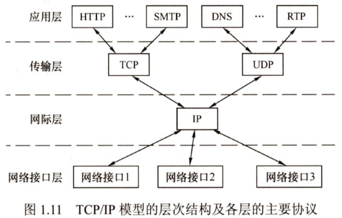
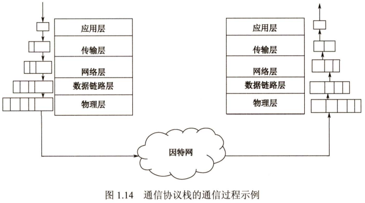

# 计算机网络

## 绪论

### 计算机网络概述

#### 计算机网络的概念

- 网络由若干结点和连接这些结点的链路组成
- 多个计算机网络可以通过路由器互连起来，这样就构成了一个覆盖范围更大的计算机网络，即互连网(internet)
- 互联网/因特网（Internet）是世界上最大的互连网络

#### 计算机网络的组成

计算机网络（这里主要指Internet）可分为边缘部分和核心部分。

- 边缘部分由所有连接到因特网上、供用户直接使用的主机组成，用来进行通信（如传输数据、音频或视频）和资源共享
- 核心部分由大量的网络和连接这些网络的路由器组成，它为边缘部分提供连通性和交换服务

#### 计算机网络的功能

计算机网络的功能很多，主要有五大功能：数据通信、资源共享、分布式处理、提高可靠性、负载均衡

#### 计算机网络的分类

1. 按覆盖范围分类

   - 广域网(WAN)

     提供长距离通信，覆盖范围通常是直径为几十千米到几千千米的区域，因而有时也称远程网。广域网是因特网的核心部分。连接广域网的各结点交换机的链路一般都是高速链路，具有较大的通信容量。

   - 城域网(MAN)

     覆盖范围可以跨越几个街区甚至整个城市，覆盖区域的直径为5~50km。城域网大多采用以太网技术，因此有时也常并入局域网的范围讨论。

   - 局域网(LAN)

     一般用微机或工作站通过高速线路相连，覆盖范围较小，通常是直径为几十米到几千米的区域。局域网在计算机配置的数量上没有太多的限制，少的可以只有两台，多的可达几百台。传统上，局域网使用广播技术，而广域网使用交换技术。

   - 个人区域网(PAN)

     是指在个人工作的地方将消费电子设备（如平板电脑、智能手机等）用无线技术连接起来的网络，覆盖区域的直径约为10m。

2. 按传输技术分类

   - 广播式网络

     所有联网计算机都共享一个公共通信信道。当一台计算机利用共享通信信道发送报文分组时，所有其他的计算机都会“收听”到这个分组。接受到该分组的计算机将通过检查目的地址来决定是否接受该分组。局域网基本上都采用广播式通信技术，广域网中的无线、卫星通信网络也采用广播式通信技术。

   - 点对点网络

     每条物理链路连接一对计算机。若通信的两台主机之间没有直接连接的线路，则它们之间的分组传输就要通过中间结点进行接收、存储、转发，直至目的结点。

   是否采用分组存储转发与路由选择机制是点对点网络与广播式网络的重要区别，广域网基本都属于点对点网络。

3. 按拓扑结构分类

   - 总线形网络

     用单根传输线把计算机连接起来。优点是建网容易、增删结点方便、节省线路。缺点是重负载时通信效率不高、总线任意一处出现故障则全网瘫痪。

   - 星形网络

     每个终端或计算机都以单独的线路与中央设备相连。中央设备早期是计算机，现在一般是交换机或路由器。优点是便于集中控制和管理，因为端用户之间的通信必须经过中央设备。缺点是成本高、中央设备故障则全网瘫痪。

   - 环形网络

     所有计算机接口设备连接成一个环。环可以是单环，也可以是双环，环中信号是单向传输的。

   - 网状网络

     一般情况下，每个结点至少有两条路径与其他结点相连，多用在广域网中。优点是可靠性高，缺点是控制复杂、线路成本高。

   以上4种基本的网络拓扑结构可以互连为更复杂的网络。

4. 按使用者分类

   - 公用网(Public Network)

     指电信公司出资建造的大型网络。“公用”的意思是指所有愿意按电信公司的规定交纳费用的人都可以使用这种网络。

   - 专用网(Private Network)

     指某个部门为满足本单位特殊业务的需要而建造的网络。这种网络不向本单位以外的人提供服务。

5. 按交换技术分类

   - 电路交换网络

     在源结点与目的结点之间建立一条专用的通路用于传送数据，包括建立连接、传输数据、断开连接三个阶段。最典型的电路交换网是传统电话网络。该类网络的主要特点是整个报文的比特流连续地从源点直达终点，好像是在一条管道中传送。优点是数据直接传送、时延小。缺点是线路利用率低、不能充分利用线路容量、不便于进行差错控制。

   - 报文交换网络

     将数据加上源地址、目的地址、校验码等辅助信息，然后封装成报文。整个报文传送到相邻结点，全部存储后，再转发给下一个结点，重复这一过程直到到达目的结点。这种传输方式称为存储-转发方式。优点是可以较为充分地利用线路容量，可以实现不同链路之间不同数据传输速率的转换，可以实现格式转换，可以实现一对多、多对一的访问，可以实现差错控制。缺点是增大了资源开销（如辅助信息导致处理时间和存储资源的开销），增加了缓冲时延，需要额外的控制机制来保证多个报文的顺序不乱序，缓冲区难以管理（因为报文的大小不确定，接收方在接收到报文之前不能预知报文的大小）。

   - 分组交换网络※

     将数据分成较短的固定长度的数据块，在每个数据块中加上目的地址、源地址、校验码等辅助信息，然后封装成分组（包），以存储-转发方式传输。除具备报文交换网络的优点外，分组交换网络还具有自身的优点：缓冲易于管理；包的平均时延更小，网络占用的平均缓冲区更少；更易于标准化；更适合应用。现在的主流网络基本上都可视为分组交换网络。

6. 按传输介质分类

   - 有线网络
   - 无线网络

#### 计算机网络的标准化工作

#### 计算机网络的性能指标

- 速率(Speed)

  指连接到计算机网络上的主机在数字信道上传送数据的速率，也称数据传输速率、数据率或比特率，单位为比特每秒(b/s, bit/s, bps)。数据率较高时，可用kb/s、Mb/s、Gb/s表示。

- 带宽(Bandwidth)

  原表示通信线路允许通过的信号频带范围，单位是赫兹(Hz)。而在计算机网络中，带宽表示网络的通信线路所能传送数据的能力，是数字信道所能传送的“最高数据传输速率”的同义词，单位是bps

- 吞吐量(Throughput)

  指单位时间内通过某个网络（或信道、接口）的数据量，受网络带宽或网络额定速率的限制

- 时延(Delay)

  指数据（一个报文或分组）从网络（或链路）的一端传送到另一端所需要的总时间，由以下4部分组成：

  - 发送时延 = 数据长度(b) / 发送速率(b/s)
  - 传播时延 = 信道长度(m) / 电磁波传播速率(m/s)（自由空间：3×10^8^m/s，光纤：2×10^8^m/s）
  - 处理时延
  - 排队时延

  对于高速链路，提高的仅是数据发送速率，而非比特在链路上的传播速率，从而减少数据的发送时延。

- 时延带宽积

  是传播时延与信道带宽的乘积，表示发送端发送的第一个比特即将到达终点时，发送端已经发出了多少个比特，因此由称以比特为单位的链路长度。考虑一个代表链路的圆柱形管道，其长度表示链路的传播时延，横截面积表示链路带宽，则时延带宽积表示该管道可以容纳的比特数量。

- 往返时延(Round-Trip Time, RTT)

  指从发送端发出一个分组，到发送端收到来自接收端的确认，总共经历的时延。

- 信道利用率

  指某信道由百分之几的时间是有数据通过的。

- 丢包率

  指在一定的时间范围内，传输过程中丢失的分组数量与总分组数量的比率。丢包的两个主要原因是分组误码和网络拥塞。

### 计算机网络体系结构

#### 计算机网络分层结构

两个系统中实体间的通信是一个很复杂的过程，为了降低协议设计和调试过程的复杂性，也为了便于对网络进行研究、实现和维护，促进标准化工作，通常对计算机网络的体系结构以分层的方式进行建模。

我们把计算机网络的各层及其协议的集合称为网络的体系结构(Architecture)。换言之，计算机网络的体系结构就是这个计算机网络及其所完成的功能的精确定义，它是计算机网络中的层次、各层的协议及层间接口的集合。

分层的基本原则如下：

- 每层都实现一种相对独立的功能，降低大系统的复杂度
- 各层之间界面自然清晰，易于理解，相互交流尽可能少
- 各层功能的精确定义独立于具体的实现方法，可以采用最合适的技术来实现
- 保持下层对上层的独立性，上层单向使用下层提供的服务
- 整个分层结构应能促进标准化工作

#### 常见的计算机网络体系结构

1. OSI体系结构

   国际标准化组织(ISO)提出的网络体系结构。OSI体系结构有7层，自下而上依次为：

   - 物理层
   - 数据链路层
   - 网络层
   - 传输层
   - 会话层
   - 表示层
   - 应用层

2. TCP/IP体系结构

   ARPA在研究ARPAnet时提出了TCP/IP体系结构。TCP/IP由于得到广泛应用而成为事实上的国际标准，自下而上依次为：

   - 网络接口层
   - 网际层
   - 传输层
   - 应用层

3. 五层协议的原理体系结构

   无论是OSI还是TCP/IP，都不是完美的。学习计算机网络时，我们往往采取折中的办法，即综合两者的优点，采用一种只有5层协议的体系结构，自下而上依次为：

   - 物理层 - 解决使用何种信号来传输比特的问题
   - 数据链路层 - 解决分组正在一个网络（或一段链路）上传输的问题
   - 网络层 - 解决分组在多个网络上传输（路由）的问题
   - 运输层 - 解决进程之间基于网络的通信问题
   - 应用层 - 解决通过应用进程的交互来实现特定网络应用的问题

   简单介绍使用通信协议栈进行通信的结点的数据传输过程。每个协议栈的最顶端都是一个面向用户的接口，下面各层是为通信服务的协议。用户传输一个数据报时，通常给出用户能够理解的自然语言，然后通过应用层，将自然语言会转化为用于通信的通信数据。通信数据到达传输层，作为传输层的数据部分（传输层SDU），加上传输层的控制信息（传输层PCI），组成传输层的PDU，然后交到网络层，传输层的PDU下放到网络层后，就成为网络层的SDU，然后加上网络层的PCI，又组成了网络层的PDU，下放到数据链路层，就这样层层下放，层层包裹，最后形成的数据报通过通信线路传输，到达接收方结点协议栈，接收方再逆向地逐层把“包裹”拆开，然后把收到的数据提交给用户。

#### 计算机网络体系结构中的专用术语

- 实体：任何可发送或接受信息的硬件或软件进程
- 对等实体：同一层的实体
- 协议：控制两个对等实体进行逻辑通信的规则的集合，是水平的
- 协议的三要素
  - 语法：规定了传输数据的格式
  - 语义：规定了所要完成的功能，即需要发出何种控制信息、完成何种动作及做出何种应答
  - 同步：规定了执行各种操作的条件、时序关系等，即事件实现顺序的详细说明
- 服务：下层为紧邻的上层提供的功能调用，是垂直的
- 服务访问点：在同一结点中相邻两层的实体交换信息的逻辑接口，用于区分不同的服务类型
- 服务原语：上层使用下层所提供的服务时必须与下层交换一些命令，这些命令称为服务原语
- 服务数据单元SDU：在同一结点中，层与层之间交换的数据单位
- 协议控制信息PCI：控制协议操作的信息
- 协议数据单元PDU：对等层次之间传送的数据单位称为该层的协议数据单元

在计算机网络体系结构的各个层次中，每个报文都分为两部分：一是数据部分(SDU)；二是控制信息部分(PCI)，它们共同组成PDU。

## 物理层

### 物理层的基本概念

1. 物理层所要解决的问题

   物理层考虑的是如何在连接各种计算机的传输媒体上传输数据比特流。

2. 物理层协议的主要任务

   - 机械特性 - 指明接口所用接线器的形状和尺寸、引脚数目和排列、固定和锁定装置
   - 电气特性 - 指明在接口电缆的各条线上出现的电压的范围
   - 功能特性 - 指明某条线上出现的某一电平的电压表示何种意义
   - 过程特性 - 指明对于不同功能的各种可能事件的出现顺序

### 通信基础*

#### 基本概念

1. 数据、信号和码元

   - 数据是传送信息的实体，信号是数据的电气或电磁表现，是数据在传输过程中的存在形式
   - 数据和信号都可用“模拟的”或“数字的”来修饰：
     - 连续变化的数据（或信号）称为模拟数据（或模拟信号）
     - 取值仅允许为有限的几个离散数值的数据（或信号）称为数字数据（或数据信号）
   - 数据的传输方式可分为串行传输和并行传输：
     - 串行传输还是指1比特1比特地按照时间顺序传输（计算机网络使用）
     - 并行传输是指若干比特通过多条通信信道同时传输（计算机内部使用）
   - 码元是指用一个固定时长的信号波形（数字脉冲）表示一位k进制数字，代表不同离散数值的基本波形

2. 信源、信道与信宿

   - 信源是产生和发送数据的源头，信宿是接收数据的终点
   - 信源发出的信息需要通过变换器转换成适合在信道上传输的信号，传输完毕后再通过反变换器转换成原始信息由信宿接收
   - 信道是信号的传输媒介。按传输信号形式的不同，可分为模拟信道和数字信号；按传输介质的不同，可分为无线信道和有线信道
   - 从通信双方信息的交互方式看，可分为三种基本方式：
     - 单向通信：只有一个方向的通信，仅需要一条信道。例如，无线广播、电视广播
     - 半双工通信：通信双方都可以发送或接收信息，但任何一方都不能同时发送和接收信息，此时需要两条信道。例如，对讲机
     - 全双工通信：通信双方可以同时发送和接收信息，也需要两条信道。例如，电话
   - 信道的极限容量是指信道的最高码元传输速率或信道的极限信息传输速率

3. 速率、波特与带宽

   速率也称数据率，指的是数据传输速率，表示单位时间内传输的数据量。可以用码元传输速率和信息传输速率表示。

   - 码元传输速率

     又称波特率，它表示单位时间内数字通信系统所传输的码元个数（也可称为脉冲个数或信号变化的次数），单位是波特(Baud)，即码元/秒。

   - 信息传输速率

     又称信息速率、比特率等，它表示单位时间内数字通信系统传输的二进制码元个数（即比特数），单位是比特/秒(b/s)。

   比特和比特是两个不同的概念，码元传输速率也称调制速率、波形速率或符号速率。但码元传输速率与信息传输速率在数量上又有一定的关系。若一个码元携带n比特地信息量，则M波特率的码元传输速率对应的信息传输速率为Mn比特/秒。

#### 奈奎斯特定理与香农定理

1. 奈奎斯特定理

   奈奎斯特定理又称奈氏准则，它规定：在理想低通（没有噪声、带宽有限）的信道中，为了避免码间串扰，极限码元传输速率为2W波特，其中W是理想低通信道的带宽。

   对于奈氏准则，可以得岀以下结论：

   - 在任何信道中，码元传输速率是有上限的。若传输速率超过此上限，就会出现严重的码间串扰问题，使得接收端不可能完全正确识别码元
   - 信道的频带越宽（即通过的信号高频分量越多），就可用更高的速率进行码元的有效传输
   - 奈氏准则给出了码元传输速率的限制，但并未对信息传输速率给出限制，即未对一个码元可以对应多少个二进制位给出限制

   由于码元传输速率受奈氏准则的制约，所以要提高数据传输速率，就必须设法使每个码元携带更多比特的信息量，此时就需要釆用多元制的调制方法。

2. 香农定理

   香农定理给出了带宽受限且有高斯白噪声干扰的信道的极限数据传输速率，当用此速率进行传输时，可以做到不产生误差。

   对于香农定理，可以得出以下结论：

   - 信道的带宽或信道中的信噪比越大，信息的极限传输速率越高
   - 对一定的传输带宽和一定的信噪比，信息传输速率的上限是确定的
   - 只要信息传输速率低于信道的极限传输速率，就能找到某种方法来实现无差错的传输
   - 香农定理得出的是极限信息传输速率，实际信道能达到的传输速率要比它低不少

#### 编码与调制

数据无论是数字的还是模拟的，为了传输的目的都必须转变成信号。把数据变换为模拟信号的过程称为调制，把数据变换为数字信号的过程称为编码。

### 传输介质

传输介质也称传输媒体，它是数据传输系统中发送设备和接收设备之间的物理通路。传输介质不属于物理层，处于物理层之下。

1. 双绞线

   双绞线是最常用的古老传输介质，它由两根采用一定规则并排绞合的、相互绝缘的铜导线组成。绞合可以减少对相邻导线的电磁干扰。双绞线的价格便宜，是最常用的传输介质之一，在局域网和传统电话网中普遍使用。双绞线的带宽取决于铜线的粗细和传输的距离。

2. 同轴电缆

   同轴电缆由内导体、绝缘层、网状编制屏蔽层和塑料外层构成。按特性阻抗数值的不同，通常将将同轴电缆分为两类：50Ω同轴电缆和75Ω同轴电缆。其中，50Ω同轴电缆主 要用于传送基带数字信号，又称基带同轴电缆，它在局域网中应用广泛；75Q同轴电缆主要用于传送宽带信号，又称宽带同轴电缆，主要用于有线电视系统。由于外导体屏蔽层的作用，同轴电缆具有良好的抗干扰特性，被广泛用于传输较高速率的数据，其传输距离更远，但价格较双绞线贵。

3. 光纤

   光纤通信就是利用光导纤维（简称光纤）传递光脉冲来进行通信。有光脉冲表示1，无光脉冲表示0。可见光的频率约为10^8^MHz，因此光纤通信系统的带宽范围极大。光纤不仅具有通信容量非常大的优点，还具有如下特点：

   - 传输损耗小，中继距离长，对远距离传输特别经济
   - 抗雷电和电磁干扰性能好
   - 无串音干扰，保密性好，也不易被窃听或截取数据
   - 体积小，重量轻

4. 无线传输介质

   - 无线电波

     无线电波具有较强的穿透能力，可以传输很长的距离，所以它被广泛应用于通信领域，如无线手机通信、计算机网络中的无线局域网(WLAN)等。因为无线电波使信号向所有方向散播，因此有效距离范围内的接收设备无须对准某个方向，就可与无线电波发射者进行通信连接。这也是无线电传输的最重要优点之一。

   - 微波、红外线和激光

     目前高带宽的无线通信主要使用三种技术：微波、红外线和激光。它们都需要发送方和接收方之间存在一条视线通路，又很强的方向性，都沿直线传播，有时统称三者为视线介质。

     微波通信的频率较高，频段范围也很宽，载波频率通常为2~40GHz，因此通信信道的容量大。与通常的无线电波不同，微波通信的信号是沿直线传播的，因此在地面的传播距离有限，超过一定距离后就要用中继站来接力。卫星通信利用地球同步卫星作为中继来转发微波信号，可以克服地面微波通信距离的限制。三颗相隔120°的同步卫星几乎能覆盖整个地球表面，因而基本能实现全球通信。卫星通信的优点是通信容量大、距离远、覆盖广，缺点是保密性差、端到端传播时延长。

### 物理层设备

#### 中继器

中继器的主要功能是将信号整形并放大再转发出去，以消除信号经过一长段电缆后而产生的失真和衰减，使信号的波形和强度达到所需要的要求，进而扩大网络传输的距离。其原理是信号再生（而非简单地将衰减的信号放大）。

中继器是用来扩大网络规模的最简单廉价的互联设备。中继器两端的网络部分是网段，而不是子网，使用中继器连接的几个网段仍然是一个局域网。中继器若岀现故障，对相邻两个网段的工作都将产生影响。由于中继器工作在物理层，因此它不能连接两个具有不同速率的局域网。

从理论上讲，中继器的使用数目是无限的，网络因而也可以无限延长。但事实上这不可能，因为网络标准中对信号的延迟范围做了具体的规定，中继器只能在此规定范围内进行有效的工作，否则会引起网络故障。例如，在采用粗同轴电缆的10BASE5以太网规范中，互相串联的中继器的个数不能超过4个，而且用4个中继器串联的5段通信介质中只有3段可以挂接计算机，其余两段只能用作扩展通信范围的链路段，不能挂接计算机。这就是所谓的“5-4-3规则”。

#### 集线器

集线器(Hub)实质上是一个多端口的中继器。当Hub工作时，一个端口接收到数据信号后，由于信号在从端口到Hub的传输过程中已有衰减，所以Hub便将该信号进行整形放大，使之再生（恢复）到发送时的状态，紧接着转发到其他所有（除输入端口外）处于工作状态的端 口。如果同时有两个或多个端口输入，那么输出时会发生冲突，致使这些数据都无效。从Hub的工作方式可以看出，它在网络中只起信号放大和转发作用，目的是扩大网络的传输范围，而不具备信号的定向传送能力，即信号传输的方向是固定的，是一个标准的共享式设备。

Hub主要使用双绞线组建共享网络，是从服务器连接到桌面的最经济方案。在交换式网络中，Hub直接与交换机相连，将交换机端口的数据送到桌面上。使用Hub组网灵活，它把所有结点的通信集中在以其为中心的结点上，对结点相连的工作站进行集中管理，不让出问题的工作站影响整个网络的正常运行，并且用户的加入和退岀也很自由。由Hub组成的网络是共享式网络，但逻辑上仍是一个总线网。Hub的每个端口连接的网络部分是同一个网络的不同网段，同时Hub也只能在半双工状态下工作，网络的吞吐率因而受到限制。 

## 数据链路层

本章是历年考试中考查的重点。要求在了解数据链路层基本概念和功能的基础上，重点掌握滑动窗口机制、三种可靠传输协议、各种MAC协议、HDLC协议和PPP协议，特别是CSMA/CD协议和以太网帧格式，以及局域网的争用期和最小帧长的概念、二进制指数退避算法。此外，中继器、网卡、集线器、网桥和局域网交换机的原理及区别也要重点掌握。

### 数据链路层的功能

1. 为网络层提供服务

   对网络层而言，数据链路层的基本任务是将源机器中来自网络层的数据传输到目标机器的网络层。数据链路层通常可为网络层提供如下服务：

   - 无确认的无连接服务

     源机器发送数据帧时不需先建立链路连接，目的机器收到数据帧时不需发回确认。对丢失的帧，数据链路层不负责重发而交给上层处理。该服务适用于实时通信或误码率较低的通信信道，如以太网。

   - 有确认的无连接服务

     源机器发送数据帧时不需先建立链路连接，但目的机器收到数据帧时必须发回确认。源机器在所规定的时间内未收到确认信号时，就重传丢失的帧，以提高传输的可靠性。该服务适用于误码率较高的通信信道，如无线通信。

   - 有确认的面向连接服务

     帧传输过程分为三个阶段：建立数据链路、传输帧、释放数据链路。目的机器对收到的每一帧都要给出确认，源机器收到确认后才能发送下一帧，因而该服务的可靠性最高。该服务适用于通信要求较高的场合。

2. 组帧（帧定界、帧同步与透明传输）

   两台主机之间传输信息时，必须将网络层的PDU封装成帧，以帧的格式进行传送。将一段数据的前后分别添加首部和尾部，就构成了帧。

   - 帧定界：首部和尾部中含有很多控制信息，它们的一个重要作用是确定帧的界限，即帧定界
   - 帧同步：接收方应能从接收到的二进制比特流中区分出帧的起始与终止
   - 透明传输：不管所传数据是什么样的比特组合（即使包含与帧定界符相同的比特组合），都应当能在链路上传送

3. 差错控制

   差错控制是指使发送方确定接收方是否正确收到由其发送的数据。

4. 链路管理

   数据链路层连接的建立、维持和释放过程称为链路管理，它主要用于面向连接的服务。

5. 流量控制

   流量控制是指限制发送方的数据流量，使其发送速率不超过接收方的接收能力。

### 组帧

为了使接收方能正确地接收并检查所传输的帧，发送方必须依据一定的规则把网络层递交的分组封装成帧（称为组帧）。组帧主要解决帧定界、帧同步、透明传输等问题。通常有以下4种方法实现组帧。 

1. 字符计数法

   字符计数法是指在帧头部使用一个计数字段来标明帧内字符数。目的结点的 数据链路层收到字节计数值时，就知道后面跟随的字节数，从而可以确定帧结束的位置。

2. 字符填充的首尾定界符法

   字符填充法使用特定字符来定界一帧的开始与结束。为了使信息位中出现的特殊字符不被误判为帧的首尾定界符，可在特殊字符前面填充一个转义字符(ESC)来加以区分。如果转义字符ESC也出现在数据中，那么解决办法仍是在转义字符前插入一个转义字符。

3. 零比特填充的首尾标志法

   零比特填充法允许数据帧包含任意个数的比特，也允许每个字符的编码包含任意个数的比特。它使用一个特定的比特模式，即01111110来标志一帧的开始和结束。为了不使信息位中出现的比特流01111110被误判为帧的首尾标志，发送方的数据链路层在信息位中遇到5个连续的“1”时，将自动在其后插入一个“0”；而接收方做该过程的逆操作，即每收到5个连续的“1”时，自动删除后面紧跟的“0”，以恢复原信息。

4. 违规编码法

   借用违规编码序列来定界帧的起始和终止，不需要采用任何填充技术，便能实现透明传输，但只适用于冗余编码环境。

由于字节计数法中计数字段的脆弱性和字符填充法实现上的复杂性与不兼容性，目前较常用的组帧方法是比特填充法和违规编码法。

### 差错控制

实际通信链路都不是理想的，比特在传输过程中可能会产生差错，1可能会变成0, 0也可能会变成1，这就是比特差错。比特差错是传输差错中的一种，本节仅讨论比特差错。通常利用编码技术进行差错控制，主要有两类：检错编码和纠错编码。

#### 检错编码

检错编码都采用冗余编码技术，其核心思想是在有效数据（信息位）的基础上，按某种规则附加一定的冗余位，再进行发送。接收端根据收到的码字是否仍符合规则来判断是否出错。

1. 奇偶校验码

   - 奇偶校验码是奇校验码和偶校验码的统称，是一种最基本的校验码
   - 在信息位的首部或尾部添加一个奇校验位（或偶校验位），使得整个校验码（信息位和校验位）中“1”的个数为奇数（或偶数）
   - 它只能检测出有奇数个位出错的情况，但并不知道哪些位错了
   - 偶校验可以使用异或运算实现

2. 循环冗余校验码(CRC)

   - 基本思想

     发送方和接收方约定一个“除数”，K个信息位+R个校验位作为“被除数”，添加校验位后需保证“除法”的余数为0，收到数据后，通过做除法检查余数是否为0判断是否出错。

   - 求解步骤

     - 构造校验码

       ①确定“除数”：由商定的生成多项式(x^3^+x^2^+1)确定“除数”(1101)，若x的最高次为R，则“除数”有R+1位

       ②确定“被除数”：K个信息位+R个0，作为“被除数”

       ③确定校验位数值：进行模二除，得到R位余数

       ④确定校验码：K个信息位+R位余数=CRC码

     - 校验

       ①收到K+R位数据，进行模二除，计算R位余数

       ②余数为0，说明无错误，否则说明出错

   - 补充

     循环冗余校验码是具有纠错能力的，其校验时得到的余数与出错位置之间具有一定的关系。但在计算机网络中，数据链路层仅使用了它的检错能力，检测到帧出错则直接丢弃，是为了方便协议的实现。

#### 纠错编码

在数据通信的过程中，解决差错问题的一种方法是在每个要发送的数据块上附加足够的冗余信息，使接收方能够推导出发送方实际送出的应该是什么样的比特串。最常见的纠错编码是海明码。

1. 海明码的基本思想

   将信息位分组进行偶校验，多个校验位可反映出错位置。

2. 海明码的求解步骤

   ①确定海明码的位数：2^k^>=n+k+1

   ②确定校验位的分布：校验位P~i~放在2^i-1^的位置上，信息位按顺序放到其余位置

   ③确定分组并求校验位的值：将信息位的位置序号用k位二进制数表示，校验位P~i~与位置序号第i位为1的信息位归为同一组，进行偶校验（主要是异或运算）

   ④纠错：对P~1~,P~2~,P~3~...所属各分组进行异或（即分组偶校验），若S~3~S~2~S~1~≠000，则该二进制数值即为出错位置

3. 补充

   - 海明码有1位纠错能力和2位检错能力
   - 为了区分1位错和2位错，还需添加“全校验位”对整体进行偶校验
     - 全校验通过、分组校验通过 -> 无出错
     - 全校验不通过、分组校验不通过 -> 1位错
     - 全校验通过、分组校验不通过 -> 2位错

### 流量控制与可靠传输机制

#### 流量控制

流量控制的基本方法是由接收方控制发送方发送数据的速率，常见的方式有两种：停止-等待协议和滑动窗口协议。

1. 停止-等待流量控制基本原理

   发送方每发送一帧，都要等待接收方的应答信号，之后才能发送下一帧；接收方每接收一帧，都要反馈一个应答信号，表示可接收下一帧，如果接收方不反馈应答信号，那么发送方必须一直等待。

2. 滑动窗口流量控制基本原理

   在任意时刻，发送方都维持一组连续的允许发送的帧的序号，称为发送窗口；同时，接收方也维持一组连续的允许接收的帧的序号，称为接收窗口。发送端每接收到一个确认帧，发送窗口就向前滑动一个帧的位置，当发送窗口内没有允许发送的帧时，发送方就会停止发送。接收端收到数据帧后，将窗口向前移动一个位置，并发回确认帧，若收到的数据帧落在接收 窗口之外，则一律丢弃。

#### 可靠传输

数据链路层的可靠传输通常使用确认和超时重传两种机制来完成。

- 确认是一种无数据的控制帧，这种控制帧使得接收方可以让发送方知道哪些内容被正确接收
- 超时重传是指发送方在发发送某个数据帧后就开启一个计时器，在一定时间内如果没有得到发送的数据帧的确认帧，就重新发送该数据帧

自动重传请求(Automatic Repeat reQuenst, ARQ)通过接收方请求发送方重传出错的数据帧来恢复出错的帧，是通信中用于处理信道所带来差错的方法之一。传动自动重传请求分为三种，即停止-等待(Stop-and-Wait)ARQ、回退N帧(Go-Back-N)ARQ和选择性重传(Selective Repeat)ARQ。后两种协议由于窗口尺寸开到足够大时，帧在线路上可以连续地流动，因此又称其为连续ARQ协议。注意，在数据链路层中流量控制机制和可靠传输机制是交织在一起的。 

#### 可靠传输的实现机制

1. 停止-等待协议

   - 停止-等待协议是发送窗口大小和接收窗口大小均为1的滑动窗口协议和超时重传机制的组合
   - 确认帧丢失或迟到会导致发送方或接收方收到重复分组
     - 为了让接收方能够判断收到的数据分组是否是重复的，需要给数据分组编号(1bit)
     - 为了让发送方能够判断收到的ACK分组是否是重复的，需要给ACK分组编号(1bit)
       - 数据链路层不一般不会出现ACK分组迟到的情况，因此在数据链路层实现停止-等待协议可以不用给ACK分组编号

   - 当往返时延RTT远大于数据帧发送时延T~D~时（例如使用卫星链路），信道利用率非常低
   - 若出现重传，信道利用率更低  
2. 回退N帧协议

   - 回退N帧协议是发送窗口大小大于1、接收窗口大小等于1的滑动窗口协议和超时重传机制的组合
   - 若采用n比特对帧编号，则其发送窗口的尺寸W~T~应满足1≤W~T~≤2^n^-1。若发送窗口的尺寸超出上限，接收方无法分辨新、旧数据帧
   - 当发送方需要重传某个帧时，还必须重传该帧之后的N个帧（回退N帧）
   - 接收方发出的确认帧必须指明是对哪一帧进行确认，为了减少开销，回退N帧协议还规定接收方不一定每收到一个正确的数据帧就必须立刻发回一个确认帧，而可以在连续收到好几个正确的数据帧后，才对最后一个数据帧发送确认帧，或者可在自己有数据要发送时才将对以前正确收到的帧加以捎带确认。换言之，对某一数据帧的确认就表明该数据帧以前的所有数据帧都已正确收到
   - 若信道的传输质量很差导致误码率较大时，回退N帧协议不一定优于停止-等待协议
3. 选择重传协议
   - 选择重传协议是发送窗口大小和接收窗口大小均大于1的滑动窗口协议和超时重传机制的组合
   - 若采用n比特对帧编号，则发送窗口尺寸W~T~应满足1<W~T~≤2^n-1^，接收窗口尺寸W~R~应满足1<W~R~≤W~T~
     - 若发送窗口尺寸超出上限，接收方将无法分辨新、旧数据帧
     - 若接收窗口尺寸超出上限，没有意义
   - 接收方可接收未按序到达但没有误码且序号落在接受窗口内的数据帧，但不能再采用累计确认
   - 发送方若收到未按序到达的确认帧时，对其进行记录，以防止其相应的数据帧超时重传（选择重传），但发送窗口不能向前滑动

### 介质访问控制

共享信道要着重考虑的一个问题时如何协调多个发送站点和接收站点对一个共享传输介质的占用，即介质访问控制(Medium Access Control, MAC)。常见的介质访问控制方法有信道划分介质访问控制、随机访问介质访问控制和轮询访问介质访问控制。其中前者是静态划分信道的方法，而后两者是动态分配信道的方法。

#### 信道划分介质访问控制

当传输介质的带宽超过传输单个信号所需的带宽时，就可以通过在一条传输介质上同时携带多个传输信号的方法来提高传输系统的利用率，这就是所谓的信道复用。采用信道复用技术可把多个输入通道的信息整合到一个复用通道中，在接收端把收到的信息分离出来并传送到对应的输出通道。

信道划分的实质就是通过分频、分时、分码等方法把原来的一条广播信道，逻辑上分为好几条互不干扰的子信道，实际上就是把广播信道转变为点对点信道。信道划分介质访问控制分为以下4种。

1. 频分复用(FDM)

   - 将一条物理信道的总带宽分割成若干与传输单个信号带宽相同（或略宽）的子信道，每个子信道传输一种信号
   - 所有用户同时占用不同的频带宽度并行通信

2. 时分复用(TDM)

   - 将一条物理信道按时间分成若干时间片，轮流地分配给多个信号使用
   - 所有用户在不同的时间占用同样的频带宽度

3. 波分复用(WDM)

   - 实质上就是光的频分复用

4. 码分复用(CDM)

   将每个比特时间再划分成m个短的时间槽，称为码片(Chip)，通常m的值为64或128。为简单起见，设m为8.美格站点被指派一个唯一的m位码片序列。发送1时，站点发送它的码片序列；发送0时，站点发送它的码片序列的反码。当两个或多个站点同时发送时，各路数据在信道中线性相加。为了最终能够从信道中分离出各路信号，要求各个站点的码片序列相互正交（规格化内积为0）。

下面举一个直观的例子来理解这4种信道复用的方式：假设A站和B站都要向C站运豆子，A站运的是黄豆，B站运的是绿豆，A与C、B与C之间有一条公共道路。在频分复用方式下，公共道路被划分成两个车道，两类车可以同时行走，但只分到了公共车道的一半。在时分复用方式下，先让A到C的车走一趟，再让B到C的车走一趟，两类车交替地占用整个公共车道。在码分复用方式下，黄豆与绿豆放在同一辆车上运送，到达C后，由C站负责把车上的黄豆和绿豆分开。

#### 随机访问介质访问控制

在随机访问协议中，不采用集中控制方式解决发送信息的次序问题，所有用户能根据自己的意愿随机地发送信息，占用信道的全部速率。在总线形网络中，当有两个或多个用户同时发送信息时，就会产生帧的冲突（碰撞，即前面所说的相互干扰），导致所有冲突用户的发送均以失败告终。为了解决随机接入发生的碰撞，每个用户需要按照一定的规则反复地重传它的帧，直到该帧无碰撞地通过。这些规则就是随机访问介质访问控制协议，常用的协议有ALOHA协议、CSMA协议、CSMA/CD协议和CSMA/CA协议等，它们的核心思想都是：胜利者通过争用获得信道，从而获得信息的发送权。因此，随机访问介质访问控制协议又称争用型协议。

1. CSMA协议

   载波监听多址接入(Carrier Sense Multiple Access, CSMA)协议的主要思想是：每个站点在发送前都先监听一下共用信道，发现信道空闲后再发送。这样就会大大降低冲突的可能，从而提高信道的利用率

2. CSMA/CD协议

   载波监听多址接入/碰撞检测(Carrier Sense Multiple Access with Collision Detection, CSMA/CD)适用于总线形局域网。

   - 工作原理

     - 多点接入MA：多个主机连接在一条总线上，竞争使用总线
     - 载波监听CS：发送帧前先检测总线，若总线空闲96比特时间，则立即发送；若总线忙，则持续检测总线直到总线空闲96比特时间后再重新发送
     - 碰撞检测CD：边发送边检测碰撞，若检测到碰撞，则立即停止发送，退避一段随机时间后再重新发送

     上述过程可以概括为：先听后说，边听边说；一旦冲突，立即停说；等待时机，重新再说。

   - 争用期（碰撞窗口）

     - 发送帧的主机最多经过以太网端到端往返传播时延2τ这么长时间，就可以检测本次传输是否发生了碰撞，2τ称为争用期
     - 只有经过争用期这段时间还没有检测到碰撞，才能肯定这次发送不会发生碰撞
     - 以太网规定2τ的取值为512比特时间（即发送512比特所耗费的时间）

   - 最小帧长和最大帧长

     - 为了确保主机在发送数据的同时能检测到碰撞，帧的发送时延至少为2τ，即 最小帧长 = 争用期 × 信道带宽（数据发送速率）
     - 为了防止主机长时间占用总线，以太网的帧不能太长。以太网V2的MAC帧最大长度为1518字节；插入VLAN标记的802.1Q帧最大长度为1522字节

   - 截断二进制退避算法

     - 随机退避时间 = 争用期 × 随机数r，其中r从离散的整数集合{0, 1, 2, 3,..., 2^k^-1}中随机选取，k=min{重传次,10}
     - 当重传达16次仍不能成功时，说明网络太拥挤，认为该帧永远无法正确发出，则丢弃该帧并向高层报告

3. CSMA/CA协议

### 局域网

### 广域网

### 数据链路层设备
